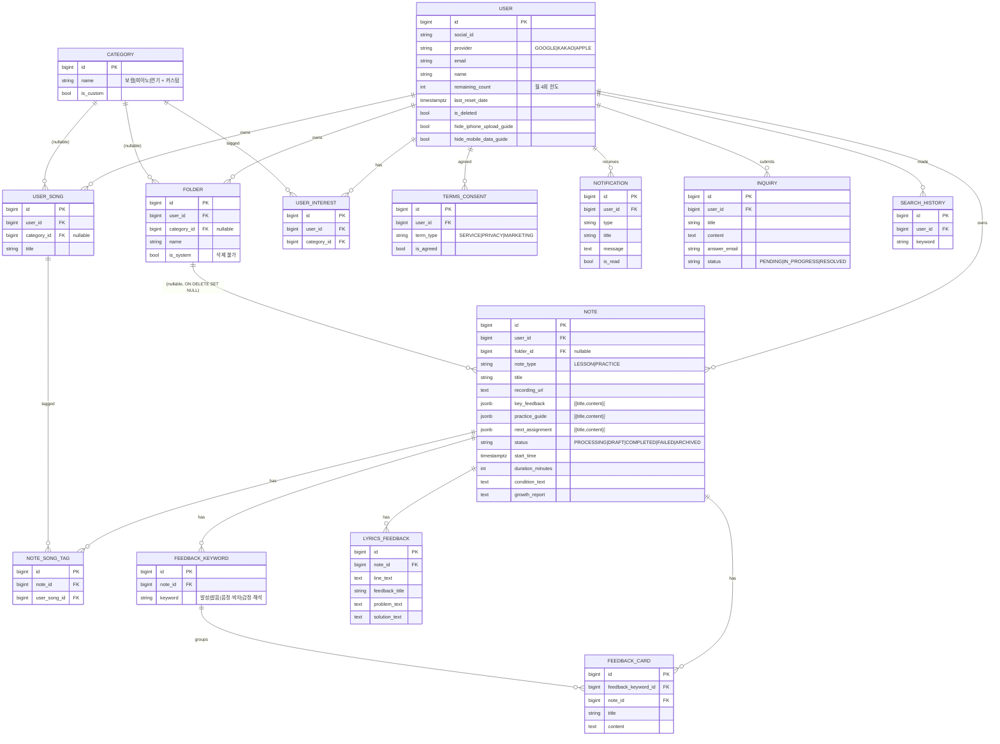

# PROJECT_README

Artlog 프로젝트의 전체 구조 — 프론트, 백엔드, AI 서버, 데이터 모델, API 명세, 처리 흐름 — 을 한 곳에 정리합니다. **새 기능을 만들거나 구조를 바꾸기 전에 먼저 이 문서를 확인합니다.** 기능 구현이 끝나면 이 문서와 함께 갱신합니다.

세부 주제별 문서는 별도로 관리합니다.

| 주제 | 문서 |
|------|------|
| RAG / 성장 리포트 | [RAG_README.md](RAG_README.md) |
| 개발 로그 (의사결정 기록) | [DEV_LOG_README.md](DEV_LOG_README.md) |
| 자기소개서용 흐름 정리 | [MY_README.md](MY_README.md) |
| OAuth 검증 환경 | [VERIFY_AUTH_ENV.md](VERIFY_AUTH_ENV.md) |

---

## 1. 서비스 개요

Artlog는 보컬·피아노·연기 등 예술 레슨 녹음본을 업로드하면 AI가 레슨노트(핵심 피드백, 연습 가이드, 다음 과제, 가사별 피드백)와 성장 리포트를 자동 생성해주는 PWA 서비스입니다.

### 1-1. 서비스 토폴로지

```
┌─────────────┐     HTTPS      ┌──────────────────┐    HTTP    ┌─────────────────┐
│  Front (PWA)│ ───────────────▶│  Back (Spring)   │──────────▶│  AI (FastAPI)   │
│  React/Vite │ ◀───── SSE ─────│  Spring Boot 3   │◀── SSE ───│  LangGraph 8단계 │
└─────────────┘                 └────────┬─────────┘           └────────┬────────┘
                                         │                              │
                                  ┌──────┴──────┐                       │
                                  │             │                       │
                             ┌────▼────┐   ┌────▼─────┐                 │
                             │ Postgres│   │  Redis   │                 │
                             │ pgvector│◀──┤(큐+진행률)│                 │
                             └────▲────┘   └──────────┘                 │
                                  │                                     │
                                  └─────────────────────────────────────┘
                                       (AI도 같은 Postgres 직접 사용:
                                        lesson_note_embedding 직접 사용)
```

### 1-2. 책임 분담

| 서비스 | 책임 | 포트 |
|---|---|---|
| **Front** | UI, OAuth 콜백 처리, accessToken 보관, SSE 구독 | 5173 |
| **Back (Spring)** | 도메인 API, 인증/JWT, 파일 업로드, Redis 큐잉, AI 서버 호출, SSE 중계 | 8080 |
| **AI (FastAPI)** | LangGraph 8단계 파이프라인 (STT/보정/분석/생성/검토/임베딩/성장리포트) | 8001 |
| **Postgres** | 도메인 데이터(`public`) + 벡터(`public.lesson_note_embedding`) | 5432 |
| **Redis** | 레슨노트 작업 큐 (`queue:lesson-note:pending`), 진행률 캐시 (`lesson-note:progress:{id}`), refresh token | 6379 |

---

## 2. 기술 스택

| 레이어 | 핵심 라이브러리 |
|---|---|
| Front | React 19, TypeScript 5.9, Vite 7, React Router 7, TanStack Query 5, Zustand 5, Axios 1, Tailwind 4 |
| Back | Spring Boot 3.4.3, Java 17, Spring Security, Spring Data JPA, Spring Data Redis, JJWT 0.12, springdoc-openapi 2.8, hypersistence-utils 3.9 |
| AI | FastAPI, Python 3.11, LangGraph ≥0.2.56, LangChain Core/OpenAI/Community, OpenAI SDK (Whisper / GPT / embeddings), psycopg3 + pool, pgvector, ffmpeg/ffprobe(CLI, 오디오 다운샘플·청크 분할), Tavily |
| DB | PostgreSQL 15 (`pgvector/pgvector:pg15`) |
| Cache/Queue | Redis 7-alpine |
| 배포 | Front → **Vercel** (정적 빌드 + CDN), Back/AI/DB/Redis/Caddy → **AWS EC2 단일 VPS** (Docker Compose + Caddy 자동 HTTPS + systemd). pgvector는 `CREATE EXTENSION vector` 수동 활성화 필요 |

---

## 3. 디렉터리 구조

```
artlog/
├── front/              # React + Vite (PWA)
│   ├── src/
│   │   ├── routes/         # 라우트 모음 (lesson, note, auth, onboarding, mypage, notification, search)
│   │   ├── pages/          # 페이지별 화면
│   │   ├── components/     # 공용 컴포넌트
│   │   ├── hooks/          # useUser, useLessonNote, useNoteBrowser, useNotifications, useInquiry, useLogout, useSelectedCategory
│   │   ├── lib/            # api.ts (axios + 401 재시도), auth-token.ts, query-client.ts
│   │   ├── stores/         # categoryStore (zustand)
│   │   ├── types/          # axios 모듈 보강
│   │   └── assets/         # logos / icons / fonts
│   ├── nginx.conf          # 프로덕션 nginx 정적 호스팅 (Dockerfile prod 타겟)
│   ├── vercel.json         # Vercel SPA rewrite
│   └── vite.config.ts      # alias: @, @assets, @components, @pages, @utils
│
├── back/               # Spring Boot
│   └── src/main/java/com/artlog/
│       ├── ArtlogApplication.java
│       ├── common/         # ApiResponse, ArtlogException, HealthController
│       ├── domain/
│       │   ├── auth/       # JWT 재발급/로그아웃
│       │   ├── user/       # /api/users/me
│       │   ├── note/       # 레슨노트 API + 비동기 워커
│       │   │   ├── service/
│       │   │   │   ├── NoteService                       # CRUD/조회
│       │   │   │   ├── LessonNoteJobQueueService         # Redis 큐
│       │   │   │   ├── LessonNoteWorker                  # blocking pop 워커 (SmartLifecycle)
│       │   │   │   ├── LessonNoteProcessingService       # FastAPI SSE 호출 + 결과 저장
│       │   │   │   ├── LessonNoteEventService            # SSE Emitter 관리
│       │   │   │   └── LessonNoteEmbeddingCleanupService # 노트 삭제 시 벡터 정리
│       │   ├── folder/     # 폴더 CRUD (시스템 폴더는 삭제 불가)
│       │   ├── category/   # 보컬/피아노/연기 + UserInterest
│       │   ├── song/       # UserSong (사용자별 곡 메타)
│       │   ├── notification/
│       │   ├── inquiry/
│       │   └── search/
│       └── global/
│           ├── config/     # SecurityConfig, JpaConfig, CategorySeedConfig, DatabaseSchemaSyncConfig
│           ├── security/   # JWT 필터/Provider, OAuth (Google/Kakao/Apple)
│           ├── entity/     # BaseTimeEntity (Auditing)
│           └── type/       # TitleContentItem (jsonb 공용 타입)
│
├── ai/                 # FastAPI + LangGraph
│   └── app/
│       ├── main.py             # lifespan: 풀/EmbeddingStore/workflow 초기화
│       ├── api/v1/lesson_notes.py  # /generate, /generate/stream
│       ├── core/config.py      # pydantic-settings
│       ├── schema/models.py    # 요청/응답 + AgentState
│       ├── services/embedding_store.py  # pgvector 직접 관리
│       └── graph/
│           ├── workflow.py     # 8단계 그래프 정의 (stateless 컴파일)
│           ├── state.py        # AgentState TypedDict
│           └── nodes/
│               ├── stt_agent.py            # 5분 청크 + 5초 overlap, 최대 3 병렬
│               ├── correction_agent.py
│               ├── lesson_note_agent.py    # feedback_analysis + lesson_note + review_lesson_note + route_after_review
│               └── growth_report_agent.py  # extract_improvement / embed_note / generate_growth_report
│
├── docker-compose.yml  # 5개 서비스: db, redis, app, ai, front
├── uploads/            # 오디오 업로드 디렉터리 (back과 ai에 마운트)
└── *.md                # 문서들 (PROJECT_README, RAG_README, DEV_LOG_README, MY_README, VERIFY_AUTH_ENV)
```

---

## 4. ERD (도메인 데이터 모델)

PK/FK는 모두 `BIGINT`. `BaseTimeEntity` 상속 엔티티는 `created_at`, `updated_at`을 `TIMESTAMP WITH TIME ZONE`으로 자동 관리합니다.



### 4-1. AI 전용 테이블

도메인과 분리해 AI 서버가 직접 관리합니다. LangGraph 체크포인터는 사용하지 않으며(매 호출 fresh state), 별도 스키마 없이 `public`만 씁니다.

| 영역 | 위치 | 비고 |
|---|---|---|
| 벡터 임베딩 | `public.lesson_note_embedding` | `EmbeddingStore.setup()`이 자동 생성, **`CREATE EXTENSION vector`만 수동 필요** |

`lesson_note_embedding` 컬럼:

```sql
id           BIGSERIAL PRIMARY KEY,
user_id      BIGINT NOT NULL,
note_id      BIGINT NOT NULL,
category_id  BIGINT,
folder_id    BIGINT,
content_type VARCHAR(50) NOT NULL,  -- key_feedback | feedback_card | practice_guide | improvement_noted
content      TEXT NOT NULL,
embedding    vector(1536),          -- text-embedding-3-small
created_at   TIMESTAMPTZ DEFAULT NOW()
```

자세한 검색 전략은 [RAG_README.md](RAG_README.md) 참고.

---

## 5. 백엔드 API 명세

베이스 URL: `http://localhost:8080`. 모든 응답은 `ApiResponse<T> = { success, message?, data }` 래핑. 인증 헤더는 `Authorization: Bearer <accessToken>` (Whitelist 제외 모든 엔드포인트 필수).

### 5-1. 인증 (`/api/auth`, `/oauth2`, `/login`)

| Method | Path | 설명 | 인증 |
|---|---|---|---|
| GET | `/oauth2/authorization/{provider}` | OAuth 시작 (`google` / `kakao` / `apple`) → state 쿠키 발급 후 provider로 redirect | 불필요 |
| GET | `/login/oauth2/code/{provider}` | OAuth 콜백 → 토큰 발급 + `accessToken`을 frontend redirect URL에 query로 전달 | 불필요 |
| POST | `/login/oauth2/code/apple` | Apple form_post 콜백 (`application/x-www-form-urlencoded`) | 불필요 |
| POST | `/api/auth/reissue` | refresh_token 쿠키로 access token 재발급 (rotation) | refresh 쿠키 |
| POST | `/api/auth/logout` | refresh token Redis 삭제 + 세션/쿠키 정리 | optional |

토큰 정책:
- **Access Token**: JWT, frontend `localStorage.artlog_access_token`, 기본 1시간
- **Refresh Token**: HttpOnly 쿠키 `refresh_token`, Redis에 user별 1개만 보관, 사용 시 rotation, 기본 14일
- 401 응답이 오면 axios 인터셉터가 자동으로 `/api/auth/reissue`를 단일 promise로 호출 후 원 요청 1회 재시도. 실패하면 `/auth/login`으로 redirect (`front/src/lib/api.ts:51`).

### 5-2. 사용자 (`/api/users`)

| Method | Path | 설명 |
|---|---|---|
| GET | `/api/users/me` | 내 정보 + 월간 잔여 횟수 (호출 시점에 한 달 단위로 자동 갱신) |

### 5-3. 노트 (`/api/v1/notes`) — 핵심 도메인

| Method | Path | 설명 |
|---|---|---|
| POST | `/api/v1/notes/audio-upload` | `multipart/form-data` `audio` 단일 업로드 → `{ uploadedAudioPath }` |
| POST | `/api/v1/notes/lesson-upload` | `multipart/form-data` `audio?` + `payload`(JSON Blob: `title, folderId, categoryId, conditionText, songTitles[], uploadedAudioPath`) → `Note(PROCESSING)` 생성 + Redis 큐잉 |
| GET | `/api/v1/notes/recent-lessons?categoryId=` | 최근 레슨노트 목록 (카테고리 필터) |
| GET | `/api/v1/notes/{noteId}` | 노트 상세 (피드백 그룹 + 가사 피드백 + 성장 리포트 포함) |
| GET | `/api/v1/notes/{noteId}/events` | **SSE 스트림** (`text/event-stream`). `accessToken` query param 인증. `progress` 이벤트로 `{noteId, status, stage, progress, message}` 전달 |
| POST | `/api/v1/notes/{noteId}/retry-processing` | FAILED → PROCESSING 재시도 |
| DELETE | `/api/v1/notes/{noteId}` | 노트 단건 삭제 (벡터 임베딩도 함께 정리) |
| PATCH | `/api/v1/notes/{noteId}/title` | 제목 변경 |
| PATCH | `/api/v1/notes/{noteId}/move` | 폴더 이동 |
| PATCH | `/api/v1/notes/bulk-move` | 다건 폴더 이동 |
| DELETE | `/api/v1/notes/bulk-delete` | 다건 삭제 |

**SSE 인증 주의:** EventSource는 커스텀 헤더를 못 붙이므로 `?accessToken=...`로 전달하고 컨트롤러에서 `JwtTokenProvider.validateAccessToken`으로 검증 (`NoteController.resolveSseUser`).

**SSE progress 단계** (백엔드 `LessonNoteEventService` 기준):

| stage | progress | message |
|---|---|---|
| queued | 5 | 레슨노트를 준비하고 있어요. |
| stt | 15 | 녹음본을 이해하고 있어요. |
| correction | 30 | 레슨 내용을 정리하고 있어요. |
| feedback_analysis | 50 | 선생님의 피드백을 살펴보고 있어요. |
| lesson_note | 65 | 연습에 도움이 되도록 노트를 만들고 있어요. |
| review_lesson_note | 80 | 노트 내용을 한 번 더 확인하고 있어요. |
| extract_improvement | 85 | 선생님의 칭찬을 찾고 있어요. |
| embed_note | 90 | 레슨 기록을 저장하고 있어요. |
| growth_report | 95 | 성장 리포트를 작성하고 있어요. |
| completed | 100 | 레슨노트가 준비됐어요. |
| failed | 100 | 레슨노트 생성에 실패했어요. |

### 5-4. 폴더 (`/api/v1/folders`)

| Method | Path | 설명 |
|---|---|---|
| GET | `/api/v1/folders?categoryId=` | 폴더 목록 |
| POST | `/api/v1/folders` | 폴더 생성 |
| PATCH | `/api/v1/folders/{folderId}` | 이름 변경 |
| DELETE | `/api/v1/folders/{folderId}` | 삭제 (소속 노트는 '모든 노트'로 이동) |
| GET | `/api/v1/folders/{folderId}/notes?type=ALL\|LESSON\|PRACTICE` | 폴더 내 노트 |

### 5-5. 카테고리 (`/api/v1/categories`)

| Method | Path | 설명 |
|---|---|---|
| GET | `/api/v1/categories` | 카테고리 목록 |
| POST | `/api/v1/categories/interests` | 사용자 관심 카테고리 등록 (커스텀이면 새 Category 자동 생성) |

### 5-6. 곡 (`/api/v1/songs`)

| Method | Path | 설명 |
|---|---|---|
| GET | `/api/v1/songs?categoryId=` | 카테고리별 곡 |
| POST | `/api/v1/songs` | 곡 직접 추가 (`{title, categoryId}`). 같은 카테고리에 동일 제목이 있으면 기존 곡 반환 |
| GET | `/api/v1/songs/{songId}/notes` | 곡에 묶인 노트 |
| PATCH | `/api/v1/songs/{songId}` | 곡 이름 변경 |
| DELETE | `/api/v1/songs/{songId}` | 곡 삭제 |

### 5-7. 알림 (`/api/v1/notifications`)

| Method | Path | 설명 |
|---|---|---|
| GET | `/api/v1/notifications` | 최근 알림 |
| PATCH | `/api/v1/notifications/{id}/read` | 읽음 처리 |

### 5-8. 문의 (`/api/v1/inquiries`)

| Method | Path | 설명 |
|---|---|---|
| POST | `/api/v1/inquiries` | 문의 등록 |

### 5-9. 헬스체크

| Method | Path | 설명 |
|---|---|---|
| GET | `/api/v1/health` | 서비스 상태 (whitelist) |
| GET | `/actuator/health` | Spring Actuator (Railway healthcheck용) |

### 5-10. 공통 응답 / 에러

```json
// 성공
{ "success": true, "message": null, "data": { ... } }
// 에러
{ "success": false, "message": "...", "data": null }
```

`ArtlogException`이 4xx 매핑(400/401/403/404/409)을 담당, 그 외는 `ResponseStatusException` 그대로 propagation.

---

## 6. AI 서버 API 명세

베이스 URL: `http://localhost:8001`. 백엔드 워커만 호출하며 외부에 직접 노출되지 않습니다.

| Method | Path | 설명 |
|---|---|---|
| GET | `/health` | 서비스 상태 |
| POST | `/api/v1/lesson-notes/generate` | 동기 응답 (`LessonNoteResponse` 반환) |
| POST | `/api/v1/lesson-notes/generate/stream` | **SSE 스트림** — 백엔드는 이 엔드포인트만 사용 |

요청 바디(`LessonNoteRequest`):

```json
{
  "session_id": "note-{noteId}",
  "user_id": 123,
  "note_id": 456,
  "category_id": 1,
  "folder_id": 12,
  "audio_path": "/uploads/xxx.m4a",
  "song_title": ["내가 술래가 되면"],
  "keywords": [
    {"feedback_keyword_id": "1", "feedback_keyword_name": "발성"},
    {"feedback_keyword_id": "2", "feedback_keyword_name": "발음"},
    {"feedback_keyword_id": "3", "feedback_keyword_name": "음정 · 박자"},
    {"feedback_keyword_id": "4", "feedback_keyword_name": "감정 · 해석"}
  ]
}
```

스트림 이벤트:

| event | data |
|---|---|
| `progress` | `{ "stage": "stt" \| "correction" \| ... \| "growth_report" }` |
| `result` | `{ session_id, transcript, lesson_note, growth_report }` |
| `error` | `{ "message": "..." }` |

`session_id`는 로깅/추적용입니다. 워크플로우는 매 호출마다 fresh state로 실행됩니다 (체크포인터 미사용).

---

## 7. AI 파이프라인 흐름 (LangGraph 8단계)

```
   stt → correction → feedback_analysis → lesson_note → review_lesson_note
                                                             │
                                          ┌──────────────────┤
                                          │ regenerate (≤MAX_REGEN_ATTEMPTS)
                                          ↓                  │
                                       lesson_note (재실행)   │
                                                             │ end
                                                             ↓
                          extract_improvement → embed_note → growth_report → END
```

| 노드 | 역할 |
|---|---|
| `stt` | OpenAI gpt-4o-transcribe-diarize. ffmpeg로 16kHz mono 다운샘플 후 디스크에 5분 청크(+5초 overlap) 분할, 최대 3개 병렬. 전체 PCM을 메모리에 올리지 않음(저메모리 인스턴스 OOM 방지) |
| `correction` | STT 텍스트 보정 |
| `feedback_analysis` | 선생님 발화 묶음 + 관련 가사 + 분석 + 태그 추출 (`AnalyzedFeedback`) |
| `lesson_note` | 최종 레슨노트(`LessonNoteResponse`) 생성: key_feedback / practice_guide / next_assignment / feedback_card / lyrics_feedback |
| `review_lesson_note` | 섹션 중복/품질 검토. 부적합하면 `route_after_review`가 `lesson_note`로 되돌려 재생성 |
| `extract_improvement` | transcript에서 선생님 명시 칭찬/개선 인정 발화 추출 → `improvements_noted[]` |
| `embed_note` | 레슨노트 + improvement_noted를 `text-embedding-3-small`로 임베딩 후 `lesson_note_embedding` 저장 (재처리 전 동일 note_id 삭제) |
| `growth_report` | distinct note ≥ 3 일 때만 시계열 검색 + 칭찬 검색 → 성장 리포트 작성 |

**상태 관리:** stateless. LangGraph 체크포인터는 사용하지 않고 매 `ainvoke`마다 `initial_state`를 새로 빌드합니다. 재시도는 Spring 측에서 `prepareForProcessing`으로 노트 상태를 초기화한 뒤 새 큐 작업을 enqueue하는 방식. `psycopg3 AsyncConnectionPool`은 `EmbeddingStore`(pgvector 임베딩 저장/검색) 전용입니다.

성장 리포트 검색/프롬프트 디테일은 [RAG_README.md](RAG_README.md).

---

## 8. 비동기 처리 흐름 (전체 시퀀스)

```
[사용자] 오디오 선택
   │
   ▼ POST /api/v1/notes/audio-upload (multipart)
[Front] uploadedAudioPath 수신
   │
   ▼ 메타데이터 입력 후 POST /api/v1/notes/lesson-upload
[Back] Note(PROCESSING) 저장 → Redis LPUSH "queue:lesson-note:pending" {noteId}
       (TransactionTemplate 커밋 후 enqueue)
       즉시 201 Created 응답
   │
   ▼ EventSource(`/api/v1/notes/{id}/events?accessToken=...`)
[Front] SSE 구독 시작
   │
[Worker] LessonNoteWorker (SmartLifecycle, single-thread daemon)
   ├─ blockingPoll(30s) ← Redis BRPOP
   └─ LessonNoteProcessingService.process(noteId)
        ├─ progress(stt) emit
        ├─ POST {ai}/api/v1/lesson-notes/generate/stream  (SSE 호스트 호스트)
        │    ├─ FastAPI: workflow.astream(...)
        │    ├─ 각 노드 완료 시 progress 이벤트 ◀────┐
        │    └─ 마지막에 result 이벤트            │
        │                                         │
        ├─ progress 이벤트 수신 → LessonNoteEventService.update(noteId, stage)
        │    └─ Redis SET "lesson-note:progress:{id}" + Front로 SSE push
        ├─ result 이벤트 수신 → Note.completeAnalysis(...) + FeedbackKeyword/Card/Lyrics 저장
        ├─ 성공 시 audio 파일 삭제 + recordingUrl 클리어 (디스크 영구 저장 안 함)
        └─ complete(COMPLETED | FAILED) → Front SSE push + emitter.complete()
   │
[Front] progress 이벤트마다 React Query 캐시 갱신,
        COMPLETED/FAILED/ARCHIVED 수신 시 invalidate + EventSource.close()
```

**오디오 파일 정책:**
- AI 처리 중에만 `/uploads`에 임시 보관됨 (워커가 다른 스레드에서 audio_path로 AI를 호출하므로 그 사이에는 디스크에 있어야 함)
- **성공 시 즉시 삭제** + `note.recordingUrl=null` (`LessonNoteProcessingService.applyResponse`)
- **실패 시 유지** — 사용자가 retry할 수 있도록
- **노트 삭제(단건/벌크) 시** audio 파일도 함께 정리 (`NoteService.deleteNote/bulkDeleteNotes`)
- 프론트는 `recordingUrl`을 재생/표시하지 않음 (타입에만 선언, 실사용 없음)

**복구 흐름:**
- 워커 재시작 시 `failInterruptedProcessingNotes()`가 PROCESSING 상태 노트를 모두 FAILED로 전환 + 이벤트 발행 (`LessonNoteWorker.start`).
- AI 스트림 도중 클라이언트 연결 끊김(`asyncio.CancelledError`)은 정상 종료로 처리, 백엔드는 readLessonNoteStream에서 result 미수신 시 `BAD_GATEWAY`로 판단해 FAILED 처리.

**재시도:** `app.ai.max-attempts` (기본 2회). `SocketTimeoutException`만 재시도, 그 외 에러는 즉시 실패.

---

## 9. 인증 / 보안 정책

- **Spring Security**: STATELESS 세션, `JwtAuthenticationFilter`로 Bearer 토큰 검증.
- **Whitelist** (`SecurityConfig.WHITELIST`): swagger, actuator, `/api/v1/health`, `/api/auth/reissue`, `/api/auth/logout`, `/oauth2/**`, `/login/oauth2/**`, `/error`. 추가로 `GET /api/v1/notes/*/events`는 `permitAll`이지만 컨트롤러에서 query token으로 직접 검증.
- **CORS**: `app.frontend-base-url`만 허용, `Authorization, Content-Type, Accept` 헤더 + credentials 허용.
- **Refresh Token**: Redis 단일 보관, rotation 시 이전 값 즉시 무효화. 동시 401 시 axios가 단일 promise로 합쳐 race 방지.
- **Apple OAuth**: `id_token` 직접 검증 (`AppleIdentityTokenValidator` + JWKS 캐싱).

---

## 10. 환경 변수

### 10-1. 백엔드 (`back/.env`)

| 키 | 기본값 | 설명 |
|---|---|---|
| `SPRING_DATASOURCE_URL` | — | `jdbc:postgresql://db:5432/artlog_db` 등 |
| `SPRING_DATASOURCE_USERNAME` / `PASSWORD` | — | Postgres 자격 |
| `SPRING_DATA_REDIS_HOST` / `PORT` | localhost / 6379 | Redis |
| `JWT_SECRET` | change-me-... | JWT 서명 키 (필수 변경) |
| `JWT_ACCESS_TOKEN_EXPIRATION_SECONDS` | 3600 | |
| `JWT_REFRESH_TOKEN_EXPIRATION_SECONDS` | 1209600 | |
| `FRONTEND_BASE_URL` | http://localhost:5173 | CORS + redirect 기준 |
| `OAUTH2_AUTHORIZED_REDIRECT_URI` | .../auth/callback | |
| `OAUTH2_FAILURE_REDIRECT_URI` | .../auth/login | |
| `REFRESH_COOKIE_NAME` / `REFRESH_COOKIE_SECURE` | refresh_token / true | 로컬은 false |
| `REFRESH_COOKIE_SAME_SITE` | Strict | 단일도메인=Strict, 프론트/API 분리(같은 루트도메인)=Lax, cross-site=None |
| `GOOGLE_CLIENT_ID` / `GOOGLE_CLIENT_SECRET` | — | OAuth 자격 |
| `KAKAO_CLIENT_ID` / `KAKAO_CLIENT_SECRET` | — | |
| `APPLE_CLIENT_ID` / `APPLE_CLIENT_SECRET` | — | client_secret은 JWT |
| `APPLE_ISSUER` / `APPLE_PUBLIC_KEY_URL` | https://appleid.apple.com / .../auth/keys | |
| `AI_BASE_URL` | http://localhost:8001 | docker-compose에서는 `http://ai:8001` |
| `AI_CONNECT_TIMEOUT_MS` / `AI_READ_TIMEOUT_MS` / `AI_MAX_ATTEMPTS` | 5000 / 1800000 / 2 | |
| `APP_UPLOAD_DIR` | /uploads | 컨테이너 내부 경로 |

### 10-2. AI (`ai/.env`)

| 키 | 기본값 | 설명 |
|---|---|---|
| `POSTGRES_HOST` / `PORT` / `DB` / `USER` / `PASSWORD` | localhost/5432/artlog_db/artlog_user/— | psycopg3 DSN 구성 |
| `OPENAI_API_KEY` | — | 필수 |
| `TAVILY_API_KEY` | — | `correction_node` 가사 검색용. langchain이 OS 환경변수에서 직접 읽음(Settings 미선언). 누락 시 가사 검색만 생략되고 생성은 계속 |
| `LANGSMITH_TRACING` | false | "true"로 설정 시 추적 활성화 |
| `LANGSMITH_API_KEY` / `LANGSMITH_PROJECT` / `LANGSMITH_ENDPOINT` | — / artlog-ai / .smith.langchain.com | |
| `DB_POOL_MIN_SIZE` / `MAX_SIZE` | 2 / 10 | psycopg pool |

### 10-3. 프론트 (`front/.env`)

| 키 | 기본값 | 설명 |
|---|---|---|
| `VITE_API_BASE_URL` | http://localhost:8080 | 백엔드 베이스 URL (Vercel 환경변수에 설정) |

---

## 11. 로컬 실행 / 배포

### 11-1. 로컬 (전체 스택, Docker)

```bash
cp back/.env.example back/.env   # JWT_SECRET, OAuth 자격 입력
cp ai/.env.example ai/.env       # OPENAI_API_KEY 입력
docker compose up --build
```

서비스 노출: front 5173 / back 8080 / ai 8001 / db 5432 / redis 6379. Swagger: `http://localhost:8080/swagger-ui.html`.

### 11-2. 부분 실행

- Front만: `cd front && npm install && npm run dev`
- Back만: `cd back && ./gradlew bootRun` (DB/Redis 필요)
- AI만: `cd ai && pip install -r requirements.txt && uvicorn app.main:app --reload --port 8001`

### 11-3. 배포 구성 (프론트 Vercel + 백엔드 단일 VPS)

배포가 두 군데로 분리됩니다 (같은 루트도메인의 두 호스트).

- **프론트** (`artlog.site`) → **Vercel**. push 마다 정적 빌드 + CDN + 자동 HTTPS. `VITE_API_BASE_URL` 을 빌드 타임에 주입(`https://api.artlog.site`). SPA fallback 은 `front/vercel.json`.
- **백엔드 스택** (`api.artlog.site`) → **AWS EC2 단일 VPS**. `db`/`redis`/`app`/`ai`/`caddy` 를 docker compose 한 묶음으로 띄우고, Caddy 가 API 도메인에 자동 HTTPS + 모든 경로를 `app:8080` 으로 프록시. 프론트 컨테이너는 운영에서 띄우지 않음.

프론트와 API 가 **다른 호스트(cross-origin)** 이므로 세 가지가 맞물려야 합니다:

- **CORS**: 백엔드 `FRONTEND_BASE_URL` 단일 origin 허용 (`SecurityConfig.corsConfigurationSource`). 프리뷰 도메인은 미허용.
- **refresh 쿠키 SameSite**: 같은 루트도메인이면 `Lax`, 다른 사이트(`*.vercel.app`)면 `None`. 환경변수 `REFRESH_COOKIE_SAME_SITE` 로 제어 (`RefreshTokenCookieService`).
- **OAuth redirect**: 인증/콜백(`/oauth2/**`, `/login/oauth2/**`)은 API 도메인에서 처리, 성공 후 프론트 도메인(`OAUTH2_AUTHORIZED_REDIRECT_URI`)으로 redirect. OAuth 콘솔의 redirect URI 는 `https://api.artlog.site/login/oauth2/code/{provider}`.

| 위치 | 역할 |
|---|---|
| `docker-compose.yml` | 공통 정의 (dev/prod 모두). dev 에선 front 포함 |
| `docker-compose.prod.yml` | 운영 override — 외부에는 caddy 80/443 만, 소스 mount 제거, named volume 영속화, **front 는 `disabled` 프로필로 제외** |
| `front/vercel.json` | Vercel SPA rewrite (`/(.*) → /index.html`) |
| `deploy/Caddyfile` | API 도메인 → `app:8080` 전량 프록시 + SSE 패스스루 (`flush_interval -1`, `read_timeout 30m`) |
| `deploy/artlog.service` | systemd unit — 부팅 시 `docker compose up -d` 자동 기동 |
| `deploy/bootstrap.sh` | VPS 1회 셋업 (docker 설치, 레포 clone, ufw 22/80/443, unattended-upgrades) |
| `deploy/deploy.sh` | git pull → build → up -d (수동/CI 양쪽에서 호출) |
| `.github/workflows/deploy.yml` | `main` push 시 SSH 로 VPS 접속해 `deploy.sh` 실행 (백엔드만; 프론트는 Vercel 이 자체 배포) |
| `.env.prod`, `back/.env.prod`, `ai/.env.prod` | 운영 환경변수 (각 `.example` 템플릿 제공). `.env.prod` 의 `DOMAIN` 은 **API 도메인** |

영속화되는 데이터(named volume): `db_data`, `caddy_data`, `caddy_config`, `uploads`(처리 중 임시).

상세 가이드(EC2 인스턴스 사양, DNS, OAuth redirect, GHA secrets 등): [deploy/README.md](deploy/README.md).

**백업은 현재 미설정** — 단일 VPS 환경이라 사고/재해 시 데이터 소실 가능. 사용자가 늘어나면 `pg_dump` 기반 백업 스크립트 + R2/S3 오프사이트를 추가할 예정.

---

## 12. 자주 쓰는 코드 위치 인덱스

### 12-1. 백엔드

| 작업 | 위치 |
|---|---|
| 새 API 추가 | `back/src/main/java/com/artlog/domain/{도메인}/controller/` |
| 비즈니스 로직 | `.../service/` |
| 엔티티 | `.../entity/` (BaseTimeEntity 상속 권장) |
| 응답 래핑 | `common/dto/ApiResponse.java` |
| 에러 던지기 | `common/exception/ArtlogException.java` |
| 인증된 사용자 | `@AuthenticationPrincipal Object principal` → `AuthenticatedUserResolver.resolve(principal)` |
| 카테고리 시드 | `global/config/CategorySeedConfig.java` (보컬/피아노/연기 자동 생성) |

### 12-2. 프론트

| 작업 | 위치 |
|---|---|
| 새 라우트 추가 | `front/src/routes/{도메인}.tsx` 후 `routes/index.tsx`에 추가 |
| API 호출 훅 | `front/src/hooks/use{Domain}.ts` (TanStack Query) |
| 인증된 axios | `front/src/lib/api.ts` (`api` 인스턴스 사용 — Authorization 자동, 401 자동 재시도) |
| Query 캐시 무효화 키 | `recent-lesson-notes`, `lesson-note`, `folder-notes`, `song-notes`, `folders`, `auth/me`, `notifications`, `categories` |
| 전역 상태 | `front/src/stores/categoryStore.ts` (zustand) |

### 12-3. AI

| 작업 | 위치 |
|---|---|
| 새 노드 추가 | `ai/app/graph/nodes/` + `workflow.py`의 `_build_graph()`에 등록 |
| 상태 필드 추가 | `ai/app/graph/state.py`의 `AgentState` |
| 요청/응답 모델 | `ai/app/schema/models.py` |
| 벡터 검색 | `ai/app/services/embedding_store.py` |
| 환경설정 | `ai/app/core/config.py` (pydantic-settings) |

---

## 13. 최근 주요 변경 (자세한 내용은 DEV_LOG_README.md / RAG_README.md)

- **2026-06-30** 배포 전환 + AI 이미지 슬림화: VPS 빌드 폐지 → GitHub Actions 에서 app/ai 이미지를 빌드해 GHCR 에 push 하고 서버는 pull/up 만 (2GB 인스턴스 빌드 OOM/타임아웃 해소). AI `requirements.txt` 에서 미사용 `langchain-teddynote` 제거(konlpy/JPype1/kiwipiepy/pinecone/pandas/nltk 등 대형 트랜지티브 의존성 제거) + langchain/langgraph 를 0.x 계열로 상한 핀(1.x 자동 업그레이드 깨짐 방지).
- **2026-06-30** STT 메모리 최적화: pydub(`AudioSegment.from_file`, 전체 PCM 메모리 로드) 제거 → ffprobe로 길이 측정 + ffmpeg로 16kHz mono 다운샘플하며 청크를 디스크 임시 파일로 직접 추출(워커당 1개씩만 메모리에 적재). 2GB·스왑 0 인스턴스에서 긴 m4a 처리 시 발생하던 OOM(프로세스 재시작) 해결. `requirements.txt`에서 pydub 제거.
- **2026-06-07** 프론트 배포 분리: 프론트를 단일 VPS 의 Caddy/nginx 호스팅에서 **Vercel** 로 이전. API 는 VPS(`api.artlog.site`)에 유지하고 Caddy 는 `app:8080` 전량 프록시로 단순화. cross-origin 대응으로 refresh 쿠키 SameSite 를 환경변수화(`REFRESH_COOKIE_SAME_SITE`, 기본 Strict / 운영 Lax). prod compose 에서 front 컨테이너 제외(`disabled` 프로필), `front/vercel.json` 복원.
- **2026-05-05** 배포 모델 전환: Railway/Vercel → AWS EC2 단일 VPS + Docker Compose + Caddy(자동 HTTPS) + systemd. `docker-compose.prod.yml`, `deploy/{Caddyfile,artlog.service,bootstrap.sh,deploy.sh}`, GHA `deploy.yml` 추가. `railway.toml`, `vercel.json` 제거.
- **2026-05-05** 오디오 영구 저장 폐지: AI 성공 시 `/uploads`의 원본 파일 즉시 삭제 + `recordingUrl=null`. 실패 시는 retry 위해 유지하고, 노트 삭제 시 함께 정리. 프론트는 `recordingUrl`을 사용하지 않으므로 사용자 영향 없음.
- **2026-05-05** LangGraph 체크포인터 제거(`ai_agent_schema` 삭제). 미사용 데드코드였고, 동일 `thread_id` 재처리 시 잠재적 resume 버그까지 함께 제거. 워크플로우는 stateless 컴파일.
- **2026-04-12** RAG/성장 리포트 도입: pgvector 기반 임베딩 + 시계열 검색 + improvement_noted 신호 분리
- **2026-04-12** 최근 컨텍스트 보강: 새 메타데이터 없이 `created_at`으로 최근 레슨 2건 추가, 유사도 80% + 최근성 20% 혼합 랭킹
- **2026-04-11** SSE 기반 진행률 push로 전환 (Spring 스케줄러 1초 폴링 / 프론트 2초 폴링 모두 제거), Redis blocking pop 워커
- **2026-04-11** STT 5분 청크 + 5초 overlap + 최대 3 병렬, 워커 재시작 시 `PROCESSING` 노트 자동 FAILED 복구
- **2026-04-11** 신규 회원 월 4회 한도, 호출 시점 자동 갱신, 처리 중인 노트 취소 시 한도 복원

---

## 14. 이 문서를 갱신할 시점

- **새 도메인 추가**: 디렉터리 구조 / API 명세 / ERD 갱신
- **엔티티 / 컬럼 / FK 변경**: ERD + AI 전용 테이블 섹션
- **API 추가/변경**: 5장 백엔드 또는 6장 AI 표 갱신
- **AI 노드 추가/변경**: 7장 + (RAG 관련이면) RAG_README도 함께
- **인프라 / 배포 변경**: 11장
- **환경변수 추가**: 10장

원칙: **문서 갱신을 코드 변경과 같은 PR 내에 포함**합니다.
